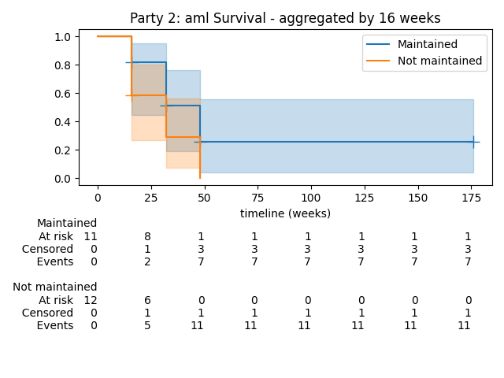

MPyC demos
==========

This is an overview of all demos available from the MPyC repository on GitHub
in `mpyc/demos <https://github.com/lschoe/mpyc/tree/master/demos>`_. Starting with
a 'Hello world!' demo, we gradually work towards demos about 
privacy-preserving machine learning and other interesting topics.
Many of the more advanced demos are in fact based on research published at
various cryptography conferences.

We give usage examples and also provide some high-level explanations. The Python code
for these demos contains many detailed examples of how to program with MPyC.

For the more advanced demos you can use the ``-h`` (or, ``--help``) switch for more
detailed usage instructions. With any demo you can also use the ``-H`` (or, ``--HELP``) switch
to consult the built-in help message for the MPyC framework; this help message is also accessible
without any demo at hand, namely by running::

   $ python -m mpyc -H

If you leave out the ``-H`` here, you directly enter an asyncio REPL with MPyC preloaded
together with some standard secure types.
This way you can quickly experiment with all kinds of MPyC functions:

.. code-block:: python

	>>> await mpc.output(list(mpc.min_max(secint(7), 8, secint(-3), 3)))
	[-3, 8]

The results can be viewed immediately through top-level ``await`` expressions, which you may know
already from Jupyter notebooks. Note that the asyncio REPL requires Python 3.8 or higher.

helloworld.py
-------------

Let's start with a simple run of the 'Hello world!' demo::

   $ python helloworld.py
   2021-06-16 09:21:07,574 Start MPyC runtime v0.7.7
   Hello world!
   2021-06-16 09:21:07,574 Stop MPyC runtime -- elapsed time: 0:00:00

By default, an MPyC program is run with just one party, which is convenient for testing purposes.
Here, the one and lonely party says hello to itself.

To test an MPyC program with multiple parties use the ``-M`` switch to set the number of parties::

   $ python helloworld.py -M 5
   2021-06-16 09:30:49,713 Start MPyC runtime v0.7.7
   2021-06-16 09:30:50,244 All 5 parties connected.
   Hello world!Hello world!Hello world!Hello world!Hello world!
   2021-06-16 09:30:50,260 Stop MPyC runtime -- elapsed time: 0:00:00.546839

This causes the demo to be run with :math:`m=5` parties, using a local TCP/IP connection between
each pair of parties, for a total of :math:`{m \choose 2}=10` connections. This way, the number of connections can go to
quite extreme levels, e.g., for :math:`m=300` there will be a whopping 44,850 connections created on your local machine::

   $ python helloworld.py -M300 --no-prss

provided you've granted your OS enough resources to handle this kind of load.

To engage in a protocol with someone else on a remote machine you can run::

   $ python helloworld.py -P localhost -P 192.168.1.22 -I0

and your peer would run::

   $ python helloworld.py -P 192.168.1.11 -P localhost -I1

The ``-P`` switches are used to set the IPv4 addresses for the two parties, where the order is significant and must be consistent.
To run the demo with more parties just keep adding ``-P`` switches. The port numbers will be set automatically, but can
also be specified in several ways.
The ``-I`` switch is used to assign a unique index :math:`i\in\{0,1,\ldots,m-1\}` to each of the :math:`m` parties.
The party's index :math:`i` is much like the `rank` assigned to a process(or) in a parallel computing context,
and it can be obtained as ``mpc.pid`` within a running MPyC program.

The actual code of the 'Hello world!' demo is very simple:

.. code-block:: python

	from mpyc.runtime import mpc

	mpc.run(mpc.start())
	print(''.join(mpc.run(mpc.transfer('Hello world!'))))
	mpc.run(mpc.shutdown())

There is not much secrecy in this program, as the hello messages are broadcast using ``mpc.transfer()`` such that
each party gets a hello message from all other parties (including one from itself).

However, ``mpc.transfer()`` is much more powerful than this, allowing parties to send private messages between each other,
basically by specifying a (directed) communication graph which can be set arbitrarily. Also, ``mpc.transfer()`` allows the parties
to send arbitrary Python objects as messages, as long as these objects can be serialized using Python's pickle module,
cf. `what-can-be-pickled-and-unpickled <https://docs.python.org/3/library/pickle.html#what-can-be-pickled-and-unpickled>`_.

See `helloworld.py <https://github.com/lschoe/mpyc/blob/master/demos/helloworld.py>`_ for more information.

oneliners.py
------------

This demo presents four oneliners in MPyC, which do some actual secure computation.
We run it with :math:`m=7` parties, this time suppressing the log messages::

   $ python oneliners.py -M7 --no-log
   m    = 7
   m**2 = 49
   2**m = 128
   m!   = 5040

We are computing some simple functions of :math:`m` here, hence there is no secrecy in this respect.
The actual computations, however, are all done on secret-shared values. Let's break down the first
oneliner which produces ``m**2 = 49`` as output:

.. code-block:: python

   mpc.output(mpc.sum(mpc.input(mpc.SecInt(2*l+1)(2*mpc.pid + 1))))

To understand the mechanics of this oneliner, we look at all intermediate results:

.. code-block:: python

   secint = mpc.SecInt(2*l+1)  # secure integers of bit length 2l+1
   a = secint(2*mpc.pid + 1)   # set a = 2i+1 for party i, i=0,...,m-1
   s = mpc.input(a)            # secret-share a with all other parties
   b = mpc.sum(s)              # sum of secret-shared entries of s
   f = mpc.output(b)           # value of secret-shared sum in the clear

We start off with ``secint`` created dynamically as a type of "secure integers" of bit length :math:`2l+1`.
We could have used the simpler call ``mpc.SecInt()`` here, which defaults to 32-bit secure integers.
But for better performance we limit the bit length to :math:`2l+1`, which is chosen to be just large enough to hold
the values that we are about to compute.

Next we let party :math:`i` create a secure integer ``a`` set to value :math:`2i+1`. The index :math:`i` is obtained
from the MPyC runtime by inspecting the attribute ``mpc.pid``. Even though these indices are known by all parties
taking part in this secure computation, the ensuing arithmetic for variable ``a`` will all be done by means of
cryptographic protocols operating on secret-shared integers.

The parties then secret-share their input through a call ``mpc.input(a)`` by which each party will obtain
a length-:math:`m` list ``s`` of secure integers. For :math:`m=7` the entries of ``s`` correspond to the
values :math:`1,3,5,7,9,11,13`. However, when the parties would inspect ``s`` from their running copies of the
MPyC program, they will not see these values. What they will be able to see are random values constituting
their *shares* of the entries of ``s``.

The sum of all entries of ``s`` is computed securely and the result is assigned to ``b``, which will also be a secure
integer. We use a call to :code:`mpc.sum()`, although in this case we can also call the Python built-in
function :code:`sum()`. The MPyC runtime handles the summation more efficiently.

Finally, we let the parties reconstruct the value of ``b`` in the clear. The call ``mpc.output(b)`` causes
the MPyC runtime to let the parties exchange their shares pertaining to the secure integer ``b``, which results
in all parties seeing :math:`1+3+5+7+9+11+13=49`.

Technically, the value of ``f`` is a Python ``Future()`` instance, whose result will hold the value 49 as a
Python integer of type `int` once the evaluation of ``f`` is done. To obtain this value we can use ``await f``
if we are inside a Python coroutine, and otherwise the call ``mpc.run(f)`` will make sure that ``f`` is evaluated.

The other oneliners can be broken down similarly. For instance, the oneliner responsible for output ``2**m = 128``
is:

.. code-block:: python

   mpc.output(mpc.prod(mpc.input(mpc.SecInt(m+2)(2))))

Here, ``mpc.prod(s)`` securely computes the product of all entries of ``s``. The MPyC runtime will organize
the computation of this product such that all required secure multiplications are done in a logarithmic number of rounds,
namely :math:`\lceil \log_2 m \rceil` rounds to be precise.

Enfin, a lot of words to sketch how and why these MPyC oneliners work.
The good news is that you should be fine forgetting most of these details when working with MPyC,
as its API has been designed to let you program secure multiparty computations as if you are working
with "ordinary" Python code.

See `oneliners.py <https://github.com/lschoe/mpyc/blob/master/demos/oneliners.py>`_ for more information.

unanimous.py
------------

In this demo we see how parties actually use a private choice as input to a secure computation.
The choice is between just two values, "yes" and "no" votes, which we encode as 1s and 0s, respectively.
For unanimous agreement we only want to learn if everybody votes "yes", which means that the *product* of
all binary encodings is equal to 1. Presence of any "no" vote will make the product equal to 0.

The case of two parties Alice and Bob finding out if they're romantically interested in each other is a special case
of unanimous agreement. When doing this in a privacy-preserving manner, we also refer to this as |MPyClogo|
`matching without embarrassments <https://youtu.be/JnmESTrsQbg>`_.
To have an honest majority we add a trusted helper as a third party.
The helper party will not provide any input.

Here's an example run between Alice, Bob, and a helper (parties :math:`i=0,1,2`)::

   $ python unanimous.py -M3 -I0 1
   No match: someone disagrees among 2 parties?

   $ python unanimous.py -M3 -I1 0
   No match: someone disagrees among 2 parties?

   $ python unanimous.py -M3 -I2
   Thanks for serving as oblivious matchmaker;)

Alice is interested in Bob, but Bob indicates that he's not interested in Alice. They do so by providing a 1 and a 0 as
input respectively. The helper party provides no input, and also gets no output, hence remains oblivious about the outcome
of this matchmaking.

The mismatch is no surprise to Bob, clearly. The whole point about this particular *secure* computation is that
Bob does not learn if Alice is interested in him or not. This bit of information remains hidden from Bob
because of the privacy-preserving property of a secure computation. The only information that parties are allowed to learn
is what they can deduce from the output that is demanded from the computation, combined with their knowledge about
the inputs that they provide to the computation.

The unanimous agreement demo generalizes matchmaking between any number of parties. For parameter :math:`t\geq0` the demo
runs between :math:`m=2t+1` in total, of which :math:`t+1` parties cast a vote, and the remaining :math:`t` parties
act as trusted helpers. The main privacy-preserving property is that even a collusion of :math:`t` voters cannot
find out what the remaining vote is, of course, unless all colluding voters input a 1.

With ``voters = list(range(1, t+1)``, where :math:`t=\lfloor m/2\rfloor`, the core of the program is formed by these two lines:

.. code-block:: python

   votes = mpc.input(secbit(vote), senders=voters)
   result = await mpc.output(mpc.all(votes), receivers=voters)

Only the voters provide input and receive output, because ``senders`` and ``receivers`` are set accordingly in the
calls to ``mpc.input()`` and ``mpc.output()``. Each voter provides a bit as private input, and all voters receive
the (same) result bit, which will be equal to 1 if and only if all votes are equal to 1.
The remaining parties :math:`i` for :math:`i=t+1,\ldots,2t+1` have no input and output, but are needed to perform
the secure multiplications for ``mpc.all(votes)``. We get *maximal* privacy in the sense that even if :math:`t` voters conspire
against one remaining voter, they cannot find that voter's vote (unless it can be deduced logically from ``result``).

See `unanimous.py <https://github.com/lschoe/mpyc/blob/master/demos/unanimous.py>`_ for more information.

ot.py
-----

In its most basic form `oblivious transfer (OT) <https://en.wikipedia.org/wiki/Oblivious_transfer>`_ is a
protocol that lets a sender transfer a message to a receiver,
such that the message will reach the receiver with probability 50% (the message will be lost otherwise).
The receiver will know whether the transfer is successful or not, but the sender will remain `oblivious` about
what is happening. This somewhat weird functionality was introduced by Michael Rabin, who recognized the
fundamental power of this primitive in cryptography.

The demo shows how 1-out-of-2 OT is accomplished easily if we rely on a trusted helper.
The trusted helper takes part as a "third" party in the protocol, not seeing any of the transferred messages.
As shown below, the trusted helper (party :math:`0`) can take part in multiple OTs run in parallel
between pairs of senders and receivers.

Here's an example run with :math:`m=5` parties.::

  $ python ot.py -M5 -I0
  You are the trusted third party.

  $ python ot.py -M5 -I1
  You are sender 1 holding messages 46 and 10.

  $ python ot.py -M5 -I2
  You are sender 2 holding messages 28 and 17.

  $ python ot.py -M5 -I3
  You are receiver 1 with random choice bit 1.
  You have received message 10.

  $ python ot.py -M5 -I4
  You are receiver 2 with random choice bit 0.
  You have received message 28.

So, party :math:`0` is the trusted helper, parties :math:`1, 2` are senders, and parties :math:`3, 4` are receivers.
In 1-out-of-2 OT, a sender holds two messages ``x[0], x[1]`` say of which the receiver will get exactly one, namely ``x[b]`` as
determined by its choice bit ``b``.

The behavior of the MPyC program for this demo depends on (the index of) the party running the program.
Typically, this is done through conditionals in terms of ``mpc.pid``. These conditionals are also used
in this demo program, to set the (random) values for the messages if party :math:`i` is a sender (:math:`1\leq i\leq t`)
or to set the (random) value for the choice bit if party :math:`t+i` is a receiver (:math:`1\leq i\leq t`).
Together with the trusted helper there are :math:`m=2t+1` parties in total, hence this demo works with an odd number
of parties.

The senders provide two numbers as private input to the protocol. In MPyC we use function ``mpc.input()`` to accomplish
this. Sender :math:`i` will provide two numbers cast to a secure type ``secnum`` (for which we actually use secure integers).
All other parties also call ``mpc.input()``, and they will put ``None`` as values, but also cast to the same secure type ``secnum``.
To indicate that (only) sender :math:`i` actually provides input, the index ``i`` of this party is passed as an
argument to ``mpc.input()``. Similarly, receiver :math:`t+i` provides its choice bit, also cast as a ``secnum`` (and all
other parties put ``None`` here as value, cast to a ``secnum``).

The heart of the program looks as follows:

.. code-block:: python

	for i in range(1, t+1):
  	    x = mpc.input([secnum(message[i-1][0]), secnum(message[i-1][1])], i)
	    b = mpc.input(secnum(choice[i-1]), t + i)
	    a = mpc.run(mpc.output(mpc.if_else(b, x[1], x[0]), t + i))

The final line arranges that only receiver :math:`t+i` gets number ``a = x[b]`` as private output.
All other parties will get ``a = None`` here. The implementation of ``mpc.if_else(b, x[1], x[0])``
will basically compute ``b*(x[1]-x[0])+x[0]``, assuming that ``b`` is a bit.

See `ot.py <https://github.com/lschoe/mpyc/blob/master/demos/ot.py>`_ for more information.

parallelsort.py
---------------

This demo is about parallel computation rather than secure computation. Using some basic ideas
from parallel computing we can let :math:`m` parties sort a list of :math:`n` numbers in :math:`O(n)`
time  in the comparison model---provided :math:`m` is sufficiently large compared to :math:`n`.

The demo shows how to sort with several built-in Python types (e.g., integers), but also how to
do this with MPyC secure types (e.g., secure fixed-point numbers). In the latter case, however,
we do not require any secrecy for the numbers that we are sorting. To enforce this, the program
sets the threshold :math:`t=0`, which is accomplished by the assignment ``mpc.threshold = 0``.
This gives the same effect as using switch ``-T 0`` on the command line.

Here's an example run with :math:`m=2` parties::

   $ python parallelsort.py -M2
   2021-06-23 09:38:40,778 Start MPyC runtime v0.7.7
   2021-06-23 09:38:41,296 All 2 parties connected.
   ====== Using MPyC integers <class 'mpyc.sectypes.SecInt32'>
   Random inputs, one per party:  [64, 51]
   Sorted outputs, one per party: [51, 64]
    * * *
   ====== Using Python integers
   Random inputs, one per party:  [56, 28]
   Sorted outputs, one per party: [28, 56]
   Random inputs, 2 (sorted) per party: [98, 856, 733, 914]
   Sorted outputs, 2 per party:         [98, 733, 856, 914]
    * * *
   ====== Using MPyC fixed-point numbers <class 'mpyc.sectypes.SecFxp32:16'>
   Random inputs, one per party:  [-61.5, -15.5]
   Sorted outputs, one per party: [-61.5, -15.5]
    * * *
   ====== Using Python floats
   Random inputs, one per party:  [-73.5, -4.5]
   Sorted outputs, one per party: [-73.5, -4.5]
   Random inputs, 2 (sorted) per party: [91.0, 92.125, 4.0, 26.375]
   Sorted outputs, 2 per party:         [4.0, 26.375, 91.0, 92.125]
    * * *
   ====== Using MPyC floats <class 'mpyc.sectypes.SecFlt32:24:8'>
   Random inputs, one per party:  [9.922563918256522e+29, 6.38978648651677e+29]
   Sorted outputs, one per party: [6.38978648651677e+29, 9.922563918256522e+29]
    * * *
   2021-06-23 09:38:41,340 Stop MPyC runtime -- elapsed time: 0:00:00.561404

For the purpose of demonstration, the program uses two ways to exchange numbers between the parties.
For the ordinary Python types we use ``mpc.transfer()``, while we use ``mpc.output(mpc.input())`` for
the secure MPyC types. Since we set :math:`t=0`, a call to ``mpc.input()`` is equivalent to sending all
parties a *copy* of the input value. This value is then recovered at the receiving party by a call to
``mpc.output()``, which is also a trivial step if :math:`t=0` as the share that each party holds
is a copy of the secret.

See `parallelsort.py <https://github.com/lschoe/mpyc/blob/master/demos/parallelsort.py>`_ for more information.

sort.py
-------

In contrast with the previous demo, this program actually performs *secure* sorting.
For a secure sort of a list of numbers, not only the values of all numbers in the list
should remain hidden, but also how the numbers are being moved around.

For this demo we start out by performing a secure random shuffle of a publicly generated list of numbers.
We use a call to ``mpc.random.shuffle()``, which links to function ``shuffle()`` in the
``mpyc.random`` module. After this call, the parties have no idea---no information, in the
information-theoretic sense---which uniformly random permutation was used to shuffle the given list.

An example run looks as follows::

   $ python sort.py -M3 --no-log 6
   Using secure integers: <class 'mpyc.sectypes.SecInt32'>
   Randomly shuffled input: [9, 25, -36, -64, 49, -16]
   Sorted by absolute value: [9, -16, 25, -36, 49, -64]
   Using secure fixed-point numbers: <class 'mpyc.sectypes.SecFxp32:16'>
   Randomly shuffled input: [25.0, 49.0, -16.0, -64.0, -36.0, 9.0]
   Sorted by descending value: [49.0, 25.0, 9.0, -16.0, -36.0, -64.0]

To show what is happening we use ``mpc.ouput()`` and print the intermediate results.
The sorting is done on the secret-shared values, however, using either the
function ``mpc.sorted()``, which mimics the Python function ``sorted()``,
or the method ``seclist.sort()`` from the ``mpyc.seclists`` module,
which mimics the Python method ``sort()`` for sorting lists in-place.

For the implementation of ``mpc.sorted()`` and ``seclist.sort()`` we have chosen
Batcher's merge-exchange sort as the favorable sorting algorithm, which has a reasonable
round complexity while keeping the total number of comparisons to a minimum.
See the Jupyter notebook
`SecureSortingNetsExplained.ipynb <https://github.com/lschoe/mpyc/blob/master/demos/SecureSortingNetsExplained.ipynb>`_
for an explanation of similar sorting networks due to Ken Batcher.

See `sort.py <https://github.com/lschoe/mpyc/blob/master/demos/sort.py>`_ for more information.

indextounitvector.py
--------------------

This demo shows a relatively simple way to convert an index :math:`a`, where :math:`0\leq a<n`,
into a length-:math:`n` unit vector with a 1 at position :math:`a` (and 0s everywhere else).
Both the input `a` and the unit vector are secret-shared throughout;
the bound `n` is regarded as public.

The function ``mpc.unit_vector()`` provides the same functionality as shown in this demo, but uses
a slightly more sophisticated approach.

Secure unit vectors play a role in many secure computations, e.g., in the Secret Santa demo that
comes next.

See `indextounitvector.py <https://github.com/lschoe/mpyc/blob/master/demos/indextounitvector.py>`_ for more information.

secretsanta.py
--------------

The `Secret Santa <https://en.wikipedia.org/wiki/Secret_Santa>`_ demo shows how to do a secure
random permutation (similar to the shuffle used above in ``sort.py``),
this time with the extra requirement that there should not be any fixed point.

The output (cut from a default run of the demo) looks like this::

   $ python secretsanta.py
   ...
   Using secure integers: SecInt32
   2 [1, 0]
   3 [1, 2, 0]
   4 [1, 0, 3, 2]
   5 [1, 0, 4, 2, 3]
   6 [1, 2, 3, 4, 5, 0]
   7 [3, 4, 6, 0, 2, 1, 5]
   8 [1, 7, 3, 6, 5, 2, 0, 4]
   ...

For actual use of this demo, with :math:`n=5` people for example, we would not simply show the permutation
``p = [1, 0, 4, 2, 3]`` to everybody, but we would make sure that only person ``i`` gets to
see the value of ``p[i]``.

The workings of the program are discussed extensively in the Jupyter notebook
`SecretSantaExplained.ipynb <https://github.com/lschoe/mpyc/blob/master/demos/SecretSantaExplained.ipynb>`_.
We basically perform a Fisher--Yates shuffle (or, Knuth shuffle) in a secure fashion, using
random unit vectors to obliviously swap list elements around. At the end we test securely if there
are any fixed points; if so, we start all over again.

The  module ``mpyc.random`` (accessible as ``mpc.random``) provides functions ``shuffle()``,
``random_permutation()``, and ``random_derangement()`` for general use with MPyC.

See `secretsanta.py <https://github.com/lschoe/mpyc/blob/master/demos/secretsanta.py>`_ for more information.

id3gini.py
----------

This demo implements the well-known `ID3 algorithm <https://en.wikipedia.org/wiki/ID3_algorithm>`_
for generating decision trees, using Gini impurity to determine the best split.
A nice aspect of our solution in MPyC is that we can stay close to the high-level recursive
description of ID3.

The demo includes a couple of well-known datasets with up to several thousands samples
and a few dozen attributes. The smallest dataset included is
`tennis.csv <https://github.com/lschoe/mpyc/blob/master/demos/data/id3/tennis.csv>`_,
which contains 14 samples with 4 attributes each (Outlook, Temperature, Humidity, Wind)::

   $ python id3gini.py --no-log -M3
   Using secure integers: SecInt32
   dataset: tennis with 14 samples and 4 attributes
   Decision tree of depth 2 and size 8:
   if Outlook == Overcast: Yes
   if Outlook == Rain:
   |   if Wind == Strong: No
   |   if Wind == Weak: Yes
   if Outlook == Sunny:
   |   if Humidity == High: No
   |   if Humidity == Normal: Yes

Now we know how to decide if the weather is fine for playing tennis today.

The MPyC program for computing ID3 decision trees only uses arithmetic with secure integers.
In particular, the computation of the Gini impurity is rearranged to avoid costly arithmetic with
secure fixed-point numbers.

The decision tree is output in the clear. Our solution in MPyC automatically takes full advantage
of this by performing work only for nodes as they appear in the output tree. All the work to do
this is scheduled dynamically between the parties in a natural way, as the Python *interpreter*
works its way through the MPyC program.

For the purpose of the demo, the parties will each load a copy of the dataset in the clear.
This allows for easy use of the demo with an arbitrary number of parties.
Upon loading the dataset, however, the program immediately converts this to a representation
in terms of secure integers.
This means that we start out with all data in secret-shared form, and subsequently, all
computations are performed using secure integer arithmetic.

In other words, the main part
of the program is agnostic of the fact that we started out with a trivial secret sharing
of the dataset (each party holding a copy of the secret).
For horizontally or vertically partitioned datasets, say, one should use ``mpc.input()`` to let the
respective parties input their parts of the dataset.

See `id3gini.py <https://github.com/lschoe/mpyc/blob/master/demos/id3gini.py>`_ for more information.

lpsolver.py
-----------

`Linear programming <https://en.wikipedia.org/wiki/Linear_programming>`_ is a basic optimization method
that you may have even learned about in high-school. This demo implements the well-known
`Simplex algorithm <https://en.wikipedia.org/wiki/Simplex_algorithm>`_ due to Dantzig.

A run with the dataset
`wiki.csv <https://github.com/lschoe/mpyc/blob/master/demos/data/lp/wiki.csv>`_,
gives the following result::

   $ python lpsolver.py -M3 -i1
   Using secure 6-bit integers: SecInt6
   dataset: wiki with 2 constraints and 3 variables (scale factor 1)
   2021-06-24 09:17:39,885 Start MPyC runtime v0.7.7
   2021-06-24 09:17:40,405 All 3 parties connected.
   2021-06-24 09:17:40,458 Iteration 1/2: 0.0 pivot=3.0
   max = 60 / 3 / 1 = 20.0 in 1 iterations
   2021-06-24 09:17:40,475 Solution x
   2021-06-24 09:17:40,476 Dual solution y
   verification c.x == y.b, A.x <= b, x >= 0, y.A <= c, y <= 0: True
   solution = [0.0, 0.0, 5.0]
   2021-06-24 09:17:40,500 Stop MPyC runtime -- elapsed time: 0:00:00.614656

This corresponds to the `example on Wikipedia <https://en.wikipedia.org/wiki/Simplex_algorithm#Example>`_.
The required bit lengths for the secure integers are preset by the demo program for each dataset.
In this simple case it suffices to work with 6-bit integers; this includes the sign bit, leaving
5 bits for the representation of the magnitude of the numbers.

Next to the optimal solution :math:`\boldsymbol{x}`, the program also outputs the dual solution :math:`\boldsymbol{y}`,
which is used as a *certificate of optimality*. If the verification
:math:`\boldsymbol{c} \cdot \boldsymbol{x} = \boldsymbol{y} \cdot \boldsymbol{b}`, :math:`A \boldsymbol{x} \leq \boldsymbol{b}`,
:math:`\boldsymbol{x} \geq 0`, :math:`\boldsymbol{y}^T A \leq \boldsymbol{c}`, :math:`\boldsymbol{y} \leq 0`
is passed, it follows that :math:`\boldsymbol{x}` is indeed a solution that maximizes :math:`\boldsymbol{c} \cdot \boldsymbol{x}`
under the constraints :math:`A \boldsymbol{x} \leq \boldsymbol{b}` and :math:`\boldsymbol{x} \geq 0`.

See `lpsolver.py <https://github.com/lschoe/mpyc/blob/master/demos/lpsolver.py>`_ for more information.

lpsolverfxp.py
--------------

The demo presents an alternative implementation of the Simplex algorithm, this time using secure fixed-point
arithmetic. Compared to the implementation above using secure integer arithmetic, we can keep the MPyC program
a bit closer to a basic description of the Simplex algorithm.

A run with the same `wiki.csv <https://github.com/lschoe/mpyc/blob/master/demos/data/lp/wiki.csv>`_
dataset as above gives::

   $ python lpsolverfxp.py -M3 -i1
   Using secure 24-bit fixed-point numbers: SecFxp24:12
   dataset: wiki with 2 constraints and 3 variables
   2021-06-24 09:45:34,054 Start MPyC runtime v0.7.7
   2021-06-24 09:45:34,586 All 3 parties connected.
   2021-06-24 09:45:34,648 Iteration 1: 0.0 pivot=3.0
   max = 19.9951171875 (error -0.024%) in 1 iterations
   2021-06-24 09:45:34,695 Solution x
   2021-06-24 09:45:34,695 Dual solution y
   verification c.x == y.b, A.x <= b, x >= 0, y.A <= c, y <= 0: True
   solution = [0.0, 0.0, 5.00244140625]
   2021-06-24 09:45:34,757 Stop MPyC runtime -- elapsed time: 0:00:00.703063

The use of secure fixed-point numbers also has the potential of limiting the overall size
of the numbers, compared to using secure integer arithmetic.

See `lpsolverfxp.py <https://github.com/lschoe/mpyc/blob/master/demos/lpsolverfxp.py>`_ for more information.

aes.py
--------------

This demo implements the `AES block cipher <https://en.wikipedia.org/wiki/Advanced_Encryption_Standard>`_
such that AES encryptions and decryptions can be performed as a multiparty computation.
The MPyC program is designed to follow the high-level specification of AES rather closely, without sacrificing performance too much.

We use the secure type ``mpc.SecFld(256)`` to represent the state of the AES algorithm. By defintion, MPyC will pick the
lexicographically first irreducible degree-8 polynomial over :math:`\mathbb{F}_2` to construct the finite field of order 256,
which coincides with the choice made for the AES polynomial.

An encryption with a 128-bit AES key runs as follows::

   $python aes.py -M3 -1
   AES-128 encryption only.
   AES polynomial: x^8+x^4+x^3+x+1
   2021-06-24 14:08:35,605 Start MPyC runtime v0.7.7
   2021-06-24 14:08:35,729 All 3 parties connected.
   Plaintext:   00112233445566778899aabbccddeeff
   AES-128 key: 000102030405060708090a0b0c0d0e0f
   Ciphertext:  69c4e0d86a7b0430d8cdb78070b4c55a
   2021-06-24 14:08:36,387 Stop MPyC runtime -- elapsed time: 0:00:00.782005

This way multiple parties are able to perform encryptions and decryptions, without ever exposing any plaintexts or AES keys.

See `aes.py <https://github.com/lschoe/mpyc/blob/master/demos/aes.py>`_ for more information.

onewayhashchains.py
-------------------

The above MPyC version of AES is used as a building block for this demo about one-way
`hash chains <https://en.wikipedia.org/wiki/Hash_chain>`_.
For an extensive explanation we refer to the Jupyter notebook
`OneWayHashChainsExplained.ipynb <https://github.com/lschoe/mpyc/blob/master/demos/OneWayHashChainsExplained.ipynb>`_.

A run with a hash chain of length :math:`n=2^3` looks as follows::

   $ python onewayhashchains.py -k 3 --no-log
   Hash chain of length 8:
      1 -
      2 -
      3 -
      4 -
      5 -
      6 -
      7 -
      8 x7    = 86b833898f4c26f2a891a061f618e6af
      9 x6    = 6bc9ce762e09dea3a435cb8f39be8863
     10 x5    = b952a69f8ca081792c060e0f16fde2ff
     11 x4    = 1e23f9b68a9867bee4f54496abb030b5
     12 x3    = 4d0998b167aa7c50d6dcf54c5891b54a
     13 x2    = 68d246d9a2316c9e3275342686d5e418
     14 x1    = 9b6ed59afd907a7d0cf4dbcae4568f34
     15 x0    = 1a0095a8fec643e8361084d4a90821c3

The hash chain starts with a (random) seed value ``x0``, then sets ``x1`` as the "hash" of ``x0``, and so on.
We write "hash" because what only matters here is that we apply a *one-way function* to compute the next
element on the chain. The values ``x0``, ``x1``, ..., ``x7`` on the chain are all 128 bits long.

For application in Lamport's identification scheme, we need to traverse the chain in backward order.
To do so efficiently for long chains, we use so-called pebbling algorithms, which can be programmed elegantly using
Python generators.

See `onewayhashchains.py <https://github.com/lschoe/mpyc/blob/master/demos/onewayhashchains.py>`_ for more information.

ridgeregression.py
-------------------

This demo presents an efficient solution for secure `ridge regression <https://en.wikipedia.org/wiki/Ridge_regression>`_.
The smaller datasets are included with the demo on GitHub, but the larger ones have to be downloaded separately
from the `UCI Machine Learning Repository <https://archive.ics.uci.edu/>`_.
To find the URL of these datasets you can use the switch ``-u`` (or, ``--data-url``)
next to ``-i7`` for instance to obtain the URL for the HIGSS dataset, which contains 11,000,000 samples (2.62 GB compressed).

A run for the `winequality-red.csv <https://github.com/lschoe/mpyc/blob/master/demos/data/regr/winequality-red.csv>`_
dataset gives the following numbers::

   $ python ridgeregression.py -M3 -i2
   2021-06-24 15:35:16,915 Start MPyC runtime v0.7.7
   2021-06-24 15:35:17,737 All 3 parties connected.
   2021-06-24 15:35:17,738 Loading dataset winequality-red
   2021-06-24 15:35:17,788 Loaded 1599 samples
   dataset: winequality-red with 1599 samples, 11 features, and 1 target(s)
   regularization lambda: 1.0
   scikit train error: [0.15929546]
   scikit test error:  [0.1681837]
   accuracy alpha: 7
   secint prime q: 58 bits (secint bit length: 26)
   secfld prime p: 313 bits
   2021-06-24 15:35:17,801 Transpose, scale, and create (degree 0) shares for X and Y
   2021-06-24 15:35:17,812 Compute A = X^T X + lambda I and B = X^T Y
   2021-06-24 15:35:17,837 Compute w = A^-1 B
   2021-06-24 15:35:17,864 Total time 0.15625 = A and B in 0.09375 + A^-1 B in 0.0625 seconds
   MPyC train error: [0.15939637]
   MPyC test error:  [0.16881036]
   relative train error: [0.00063352]
   relative test error:  [0.00372605]
   2021-06-24 15:35:17,868 Stop MPyC runtime -- elapsed time: 0:00:00.952784

The secure computation is divided into two main stages. In the first stage, we compute the matrices
:math:`A=X^T X + \lambda I` and :math:`B=X^T Y`. This is done using secure integers of bit length 26.
In the second stage, we compute the ridge regression model :math:`w = A^{-1} B`, but this we do
over a secure finite field of prime order :math:`p`, where :math:`p` is of bit length 313.
We need a large prime in the second stage to guarantee that all the integers arising during the computation
remain below :math:`p`.

See `ridgeregression.py <https://github.com/lschoe/mpyc/blob/master/demos/ridgeregression.py>`_ for more information.

kmsurvival.py
-------------------

This demo is about privacy-preserving Kaplan--Meier `survival analysis <https://en.wikipedia.org/wiki/Survival_analysis>`_.
For an extensive explanation we refer to the Jupyter notebook
`KaplanMeierSurvivalExplained.ipynb <https://github.com/lschoe/mpyc/blob/master/demos/KaplanMeierSurvivalExplained.ipynb>`_.

A run for the `aml.csv <https://github.com/lschoe/mpyc/blob/master/demos/data/surv/aml.csv>`_
dataset gives the following numbers::

   $ python kmsurvival.py --no-log -M3 -i2
   Using secure fixed-point numbers: SecFxp64:32
   Dataset: aml, with 3-party split, time 1 to 161 (stride 16) weeks
   Chi2=3.396389, p=0.065339 for all events in the clear
   Chi2=0.411455, p=0.521232 for own events in the clear
   Chi2=2.685357, p=0.101275 for aggregated events in the clear
   Chi2=3.396385, p=0.065339 for all events secure, exploiting aggregates
   Chi2=3.396390, p=0.065339 for all 161 time moments secure

The demo makes essential use of secure fixed-point numbers to do the necessary computations for the
logrank tests that are used to see if there is a significant difference between two survival curves.
For the purpose of the demo, we partition the given dataset ``aml`` evenly between the 3 parties
running the demo in this example. This is accomplished by the following line of code, where `df` is
a `pandas.DataFrame`:

.. code-block:: python

   df = df[mpc.pid::m]  # simple partition of dataset between m parties

In total, we perform the logrank test in five different ways, for varying trade-offs between efficiency
and security.

The demo also supports plotting. For instance, as a somewhat "differentially private" view of the actual
survival curves held in secret-shared form between the parties, we have the following *aggregated* view:

For a properly selected aggregation period, the information leakage on individual events may be acceptable,
at the same time ensuring that the plot still gives a useful impression of the situation.

See `kmsurvival.py <https://github.com/lschoe/mpyc/blob/master/demos/kmsurvival.py>`_ for more information.

cnnmnist.py
-------------------

This demo shows a fully private
`Convolutional Neural Network (CNN) <https://en.wikipedia.org/wiki/Convolutional_neural_network>`_
classifier at work for the
`MNIST dataset <https://en.wikipedia.org/wiki/MNIST_database>`_
of handwritten digits.

Both the CNN parameters (neuron weights and bias for all layers) and the test images
are kept secret throughout the entire multiparty computation.

A run of the demo looks as follows::

   $ python cnnmnist.py -M3
   2021-06-24 18:10:44,100 Start MPyC runtime v0.7.7
   2021-06-24 18:10:44,616 All 3 parties connected.
   2021-06-24 18:10:44,616 --------------- INPUT   -------------
   Type = SecInt37, range = (2830, 2831)
   Labels: [6]
   [[0000000000000000000000000000]
    [0000000000000000000000000000]
    [0000000011110000000000000000]
    [0000000011110000000000000000]
    [0000000111110000000000000000]
    [0000000111100000000000000000]
    [0000000111100000000000000000]
    [0000000111100000000000000000]
    [0000000111100000000000000000]
    [0000001111100000111110000000]
    [0000001111101111111111100000]
    [0000001111111111111111110000]
    [0000001111111111111111111000]
    [0000001111111111111111111000]
    [0000001111111111000011111000]
    [0000000111111100000011111000]
    [0000000111111111000011111000]
    [0000000011111111111111111000]
    [0000000011111111111111111000]
    [0000000001111111111111111000]
    [0000000000111111111111111000]
    [0000000000000111111111100000]
    [0000000000000000000000000000]
    [0000000000000000000000000000]
    [0000000000000000000000000000]
    [0000000000000000000000000000]
    [0000000000000000000000000000]
    [0000000000000000000000000000]]
   2021-06-24 18:10:44,709 --------------- LAYER 1 -------------
   2021-06-24 18:10:44,725 - - - - - - - - conv2d  - - - - - - -
   2021-06-24 18:10:45,662 - - - - - - - - maxpool - - - - - - -
   2021-06-24 18:11:49,392 - - - - - - - - ReLU    - - - - - - -
   2021-06-24 18:12:08,453 --------------- LAYER 2 -------------
   2021-06-24 18:12:08,578 - - - - - - - - conv2d  - - - - - - -
   2021-06-24 18:12:16,437 - - - - - - - - maxpool - - - - - - -
   2021-06-24 18:12:48,028 - - - - - - - - ReLU    - - - - - - -
   2021-06-24 18:12:56,762 --------------- LAYER 3 -------------
   2021-06-24 18:13:03,621 - - - - - - - - fc      - - - - - - -
   2021-06-24 18:13:04,621 - - - - - - - - ReLU    - - - - - - -
   2021-06-24 18:13:10,355 --------------- LAYER 4 -------------
   2021-06-24 18:13:10,621 - - - - - - - - fc      - - - - - - -
   2021-06-24 18:13:10,621 --------------- OUTPUT  -------------
   Image #2830 with label 6: 6 predicted.
   [-3961968811, -11882041148, -13312379672, -13152456612, -2770332627, 4413001565, 26611143242, -14166673783, -1258705244, -11310948875]
   2021-06-24 18:13:10,683 Stop MPyC runtime -- elapsed time: 0:02:26.583087

The lines printed by ``mpc.barrier()`` have been removed for brevity.
The barriers are inserted to speed up the overall computation: without any barriers the MPyC program
will first build the "circuit" for the complete neural network, before evaluating any "gate" of this
circuit. Placement of the barriers ensures that the "circuit" is divided into more manageable
parts, such that the parties have sufficiently many "gates" to work on in parallel.

See `cnnmnist.py <https://github.com/lschoe/mpyc/blob/master/demos/cnnmnist.py>`_ for more information.

bnnmnist.py
-------------------

This demo presents an alternative fully private MNIST classifier, namely a Binarized Neural Network
(`Multilayer Perceptron <https://en.wikipedia.org/wiki/Multilayer_perceptron>`_) classifier.

The layers of the network are fully connected to each other, and all weights in
the network as well as the values of the activation functions have been "binarized", that is,
mapped to 1 or -1. Also, we use a special type of secure comparison protocol to speed up
the activation functions.

A run for a batch of 8 digits looks as follows::

   $python bnnmnist.py -M3 -o2830 -b8
   2021-06-24 18:36:19,458 Start MPyC runtime v0.7.7
   2021-06-24 18:36:19,974 All 3 parties connected.
   2021-06-24 18:36:19,974 --------------- INPUT   -------------
   Type = SecInt14(9409569905028393239), range = (2830, 2838)
   Labels: [6, 6, 5, 7, 8, 4, 4, 7]
   2021-06-24 18:36:20,052 --------------- LAYER 1 -------------
   2021-06-24 18:36:20,052 - - - - - - - - fc      - - - - - - -
   2021-06-24 18:36:20,583 - - - - - - - - bsgn    - - - - - - -
   2021-06-24 18:37:10,455 --------------- LAYER 2 -------------
   2021-06-24 18:37:10,455 - - - - - - - - fc      - - - - - - -
   2021-06-24 18:38:01,876 - - - - - - - - bsgn    - - - - - - -
   2021-06-24 18:38:07,720 --------------- LAYER 3 -------------
   2021-06-24 18:38:07,720 - - - - - - - - fc      - - - - - - -
   2021-06-24 18:38:55,669 - - - - - - - - bsgn    - - - - - - -
   2021-06-24 18:39:01,685 --------------- LAYER 4 -------------
   2021-06-24 18:39:01,685 - - - - - - - - fc      - - - - - - -
   2021-06-24 18:39:01,841 --------------- OUTPUT  -------------
   Image #2830 with label 6: 6 predicted.
   [-723, -620, -613, -552, -718, -687, 1042, -901, -567, -570]
   Image #2831 with label 6: 6 predicted.
   [-517, -608, -437, -368, -538, -249, 564, -1273, -683, -478]
   Image #2832 with label 5: 5 predicted.
   [-652, -581, -464, -675, -443, 840, -463, -340, -532, -559]
   Image #2833 with label 7: 7 predicted.
   [-566, -603, -590, -487, -497, -1312, -1707, 786, -486, -701]
   Image #2834 with label 8: 8 predicted.
   [-469, -724, -569, -590, -592, -621, -734, -543, 957, -514]
   Image #2835 with label 4: 4 predicted.
   [-455, -500, -607, -524, 940, -407, -540, -523, -441, -704]
   Image #2836 with label 4: 4 predicted.
   [-599, -260, -385, -460, 146, -559, -934, -387, -749, -648]
   Image #2837 with label 7: 7 predicted.
   [-532, -603, -588, -397, -357, -1764, -1697, 770, -396, -511]
   2021-06-24 18:39:02,044 Stop MPyC runtime -- elapsed time: 0:02:42.585459

Note that ``SecInt14(9409569905028393239)`` is used as secure type.
These are 14-bit secure integers, where :math:`p=9409569905028393239` is the prime
that we have set for the underlying finite field to be used for Shamir secret sharing.
The prime :math:`p` is selected to get a fast protocol for secure comparisons,
exploiting properties of the Legendre symbol of integers modulo :math:`p`.

See `bnnmnist.py <https://github.com/lschoe/mpyc/blob/master/demos/bnnmnist.py>`_ for more information.

run-all.{bat,sh}
----------------

All the demos from ``helloworld.py`` up to ``onewayhashchains.py`` can be run in one go using
`run-all.bat <https://github.com/lschoe/mpyc/blob/master/demos/run-all.bat>`_ or
`run-all.sh <https://github.com/lschoe/mpyc/blob/master/demos/run-all.sh>`_.
These demos have no dependencies other than MPyC itself.
You can also provide parameters like ``-M 3`` to run all demos with three parties.

The more advanced demos from ``ridgeregression.py`` up to ``bnnmnist.py`` are not included here
because these have some dependencies such as NumPy.
